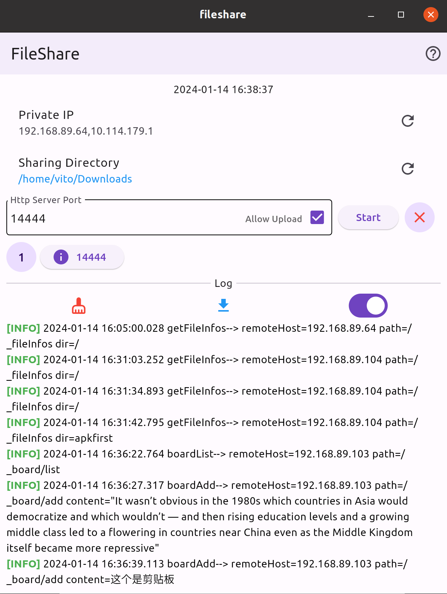
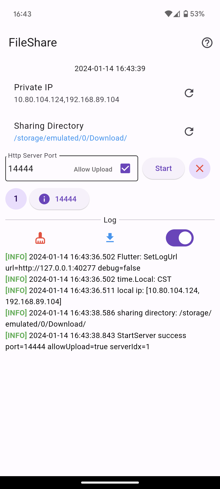
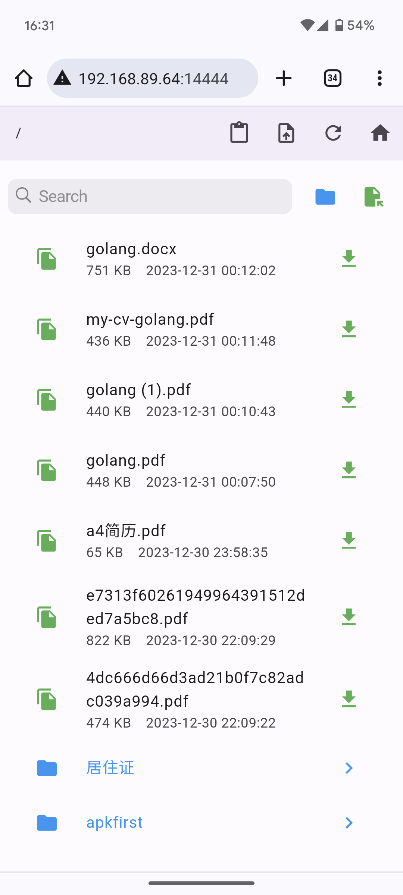
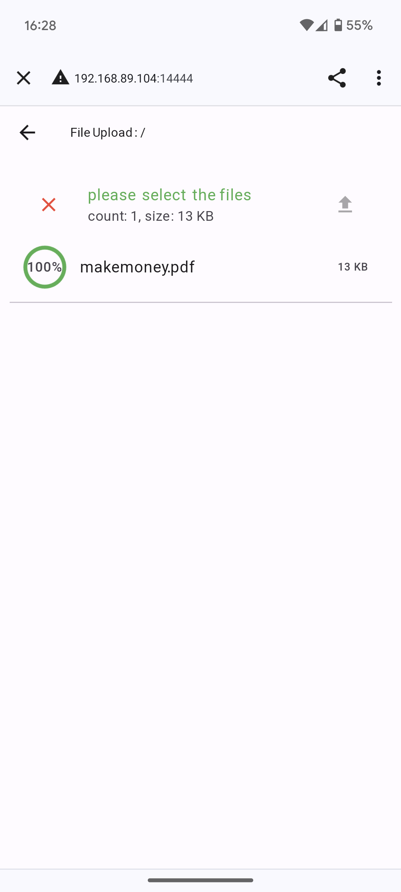
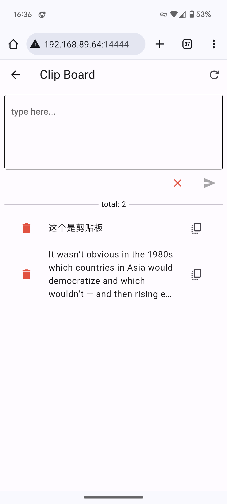

## Getting Started
```shell
make build
```
the binary file will be generated in the `bin` directory. linux, windows and android are supported.


## Project Tree
```
├── bin
├── fileshare
├── fileshare_go
├── fileshare_web
├── makefile
└── readme.md
```
- bin: the binary file directory. apk(android) and deb(linux) are supported.
- fileshare: the `flutter` source code of the file share server.
- fileshare_go: the `go` source code of the file share server.
- fileshare_web: the web source code of the file share server.
- makefile: the makefile of the project.
- readme.md: the readme file of the project.

## Dependencies
- windows环境下，需要对CGO进行支持
- 如果没有安装对应的 CGO 运行时环境、则在运行的时候会引发如下错误。
  > exec: “gcc”: executable file not found in %PATH%
  - Windows GO 语言 CGO 运行时环境配置
      - https://www.expoli.tech/articles/2022/10/18/1666087321618
        
  - Make for Windows
      - https://gnuwin32.sourceforge.net/packages/make.htm
      - Complete package, except sources
## Preview

- Run in Linux and Android

 

---
- Open in browser

  

